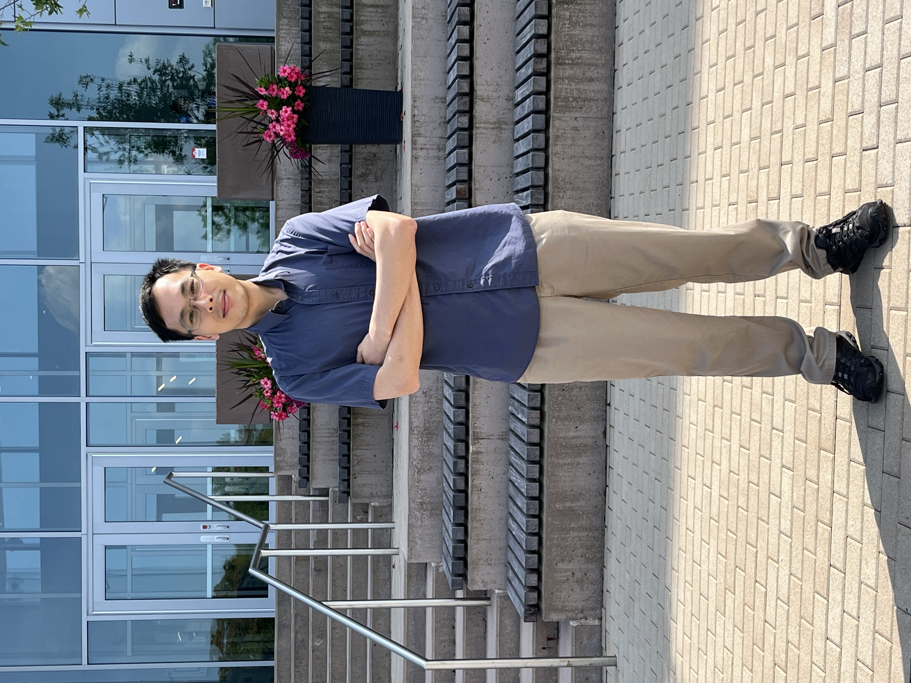

<!--  -->

Research Interests
=====
I have a broad interest in theoretical condensed matter physics and its application to material science, now focusing on:

 - __Machine learning methods in material discovery__

 - __Moiré engineering in twisted multilayer systems__

 - __Band topology, quantum geometry, and their responses__

In addition, I have experience on studying __Luttinger liquid theory__ and am also interested in __non-equilibrium systems__.

Profile
=====
* __PhD Candidate__. Department of Physics, Northeastern University
* __PhD Advisor__: [Prof. Arun Bansil](https://cos.northeastern.edu/people/arun-bansil/)
* __Office__: Elliott Hall 130 ([Quantum Material and Sensing Institute](https://quantum.northeastern.edu/), Burlington, MA)
* __Email__: hung.yi@northeastern.edu
* __Recent preprints__ on [arXiv](https://arxiv.org/search/advanced?advanced=&terms-0-operator=AND&terms-0-term=Yi-Chun+Hung&terms-0-field=author&classification-physics=y&classification-physics_archives=cond-mat&classification-include_cross_list=include&date-filter_by=past_12&date-year=&date-from_date=&date-to_date=&date-date_type=submitted_date&abstracts=show&size=50&order=-announced_date_first)
* [Google Scholar](https://scholar.google.com/citations?user=rEfFuMEAAAAJ&hl=en-US)

News
=====
* 2025-07-15: Updated Publications. A new paper ["Geometry-driven moiré engineering in twisted bilayers hosting high-pseudospin fermions"](https://journals.aps.org/prb/abstract/10.1103/3kws-k867) is published on Physical Review B.
* 2025-06-28: Uploaded a preprint on [arXiv](https://arxiv.org/abs/2506.22715).
