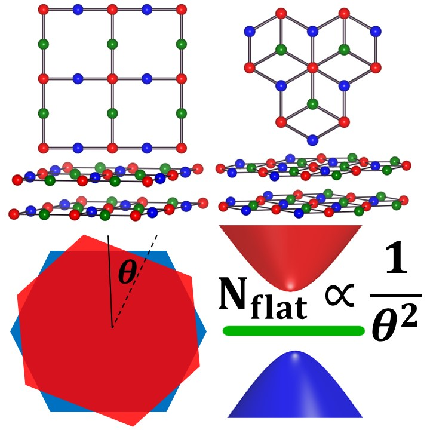

<strong>Flat bands</strong>, characterized by nearly zero dispersion and vanishing group velocity, suppress electronic kinetic energy and amplify interaction effects&mdash;often giving rise to correlated phases. Beyond the energetics, the <strong>quantum geometry</strong> of these bands has also been shown to play a central role in shaping low-energy correlations (<a href="https://arxiv.org/abs/2501.00098" target="_blank">Yu et al., 2025</a>). A prominent setting for realizing such bands is in <strong>moiré systems</strong>, where stacking 2D materials with a small twist angle or lattice mismatch produces long-wavelength interference patterns that yield isolated flat bands. Notable examples include twisted bilayer graphene (<a href="https://www.pnas.org/doi/full/10.1073/pnas.1108174108" target="_blank">Bistritzer and MacDonald, 2011</a>) and twisted bilayer transition metal dichalcogenide (<a href="https://www.nature.com/articles/s41467-021-27042-9" target="_blank">Devakul et al., 2021</a>) near the magic angle, which have led to the observation of superconductivity (<a href="https://www.science.org/doi/full/10.1126/science.aav1910" target="_blank">Yankowitz et al., 2019</a>) and fractional Chern insulators (<a href="https://www.nature.com/articles/s41586-023-06536-0" target="_blank">Park et al., 2023</a>). These moiré-induced flat bands offer a tunable platform to explore strongly correlated and topological phenomena.

An alternative route to realizing flat bands lies in <i>lattice geometry</i> itself, where destructive interference or local constraints can suppress the dispersion in certain geometrically frustrated lattices&mdash;such as kagome lattice (<a href="https://academic.oup.com/ptp/article/6/3/306/1852171" target="_blank">Syozi, 1951</a>). A particularly illustrative class involves <strong>bipartite lattices</strong> with an imbalance numbers between sublattice sites, where flat bands emerge due to such an imbalance (<a href="https://www.nature.com/articles/s41567-021-01445-3" target="_blank">Calugaru et al., 2022</a>). Notable examples include Lieb (<a href="https://journals.aps.org/prl/abstract/10.1103/PhysRevLett.62.1201" target="_blank">Lieb, 1989</a>) and dice (<a href="https://journals.aps.org/prb/abstract/10.1103/PhysRevB.34.5208" target="_blank">Sutherland, 1986</a>) lattices. These systems exhibit <strong>geometry-induced flat bands</strong> that are robustly tied to the underlying lattice geometry, and they provide a complementary platform to moiré materials for exploring flat band physics.

<figure style="float: right; width: 40%; text-align: center; margin-left: 1em;">
  
  <figcaption style="font-size: 1em;">Schematics of generation of isolated flat bands through moiré engineering.
  </figcaption>
</figure>

It is then natural to ask: what new physics might emerge when these two flat-band-generating mechanisms&mdash;moiré engineering and lattice geometry&mdash;are combined in a single system. Surprisingly, our study shows that the geometry-induced flat bands become isolated due to the moiré potential. Furthermore, <i><strong>the numbers of isolated flat bands vary with twist angle</strong></i> <a href="#1">[1]</a>&mdash;a new physics that has never been found in popular twisted bilayer systems. In addition to bipartite lattices, we also proposed a newly discovered lattice structure&mdash;the <i>watermill lattice</i>&mdash;hosting low-energy states with high-pseudospin structures induced by its lattice geometry. This leads to four isolated flat bands and an enhanced quantum geometry in its twisted bilayer <a href="#2">[2]</a>. These results serve as compelling examples of how lattice geometry and moiré engineering can work in tandem to realize and control flat-band electronic structures.

## Related Publications
 - <a name="1">[1]</a> Xiaoting Zhou\*, __Yi-Chun Hung\*__, Baokai Wang\*, and Arun Bansil. Generation of isolated flat bands with tunable numbers through moiré engineering. [_Phys. Rev. Lett. 133_, 236401 (2024; _Editors' Suggestion_)](https://lengentyh.github.io/YiChunHung_Physics//publication/2024-12-06-spin-1).

 - <a name="2">[2]</a> __Yi-Chun Hung\*__, Xiaoting Zhou\*, and Arun Bansil. Geometry-driven moiré in twisted bilayers of high pseudospin fermions. [_Phys. Rev. B 112_, L041403 (2025)](https://lengentyh.github.io/YiChunHung_Physics//publication/2025-07-14-watermill).