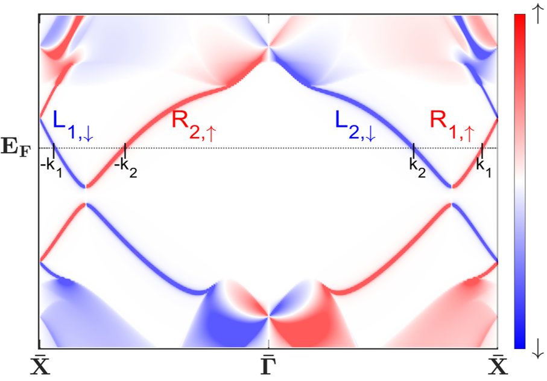

<strong>Helical edge states</strong> are 1D conducting channels where electron with different spin move in opposite directions. These states usually emerge at the edges of <strong>Quantum Spin Hall Insulators (QSHIs)</strong> (<a href="https://journals.aps.org/prl/abstract/10.1103/PhysRevLett.95.226801" target="_blank">Kane and Mele, 2005</a>). Their helical nature forbids elastic backscattering in the absence of time-reversal symmetry (TRS) breaking, resulting in robust spin-polarized transport along the edge. However, in 1D systems, electron–electron interactions are inevitable and often play a crucial role in determining the low-energy physics (<a href="https://books.google.com/books?id=1MwTDAAAQBAJ" target="_blank">Giamarchi, 2004</a>). The helical nature prohibits backscattering but allows only forward scattering, making the system an ideal platform for realizing a <strong>helical Luttinger liquid (HLL)</strong> (<a href="https://journals.aps.org/prl/abstract/10.1103/PhysRevLett.96.106401" target="_blank">Wu et al., 2006</a>). In this interacting regime, the edge states exhibit collective behavior and non-Fermi liquid characteristics, such as power-law scaling of correlation functions and interaction-dependent transport properties (<a href="https://iopscience.iop.org/article/10.1088/1361-6641/ac2c27" target="_blank">Hsu et al., 2021</a>). The helical Luttinger liquid thus provides a natural theoretical framework to capture the interplay between topology and strong correlations in one-dimensional edge systems.

<figure style="float: right; width: 40%; text-align: center; margin-left: 1em;">
  
  <figcaption style="font-size: 1em;">A schematic of helical edge states in a DQSHI <a href="#5">[5]</a>.</figcaption>
</figure>

<strong>Double Quantum Spin Hall Insulators (DQSHIs)</strong> extend the QSHI concept by supporting two independent helical edge channels, often arising from systems with high spin Chern or mirror Chern numbers <a href="#1">[1]</a><a href="#2">[2]</a>. Such a high spin (mirror) Chern number indicates that the edge Dirac cones are not protected by TRS and can be open due to spin-U(1) symmetry breaking perturbations. Also, the coexistence of multiple helical edge modes introduces the possibility of inter-channel forward scattering. These properties indicate that low-energy states in DQSHIs can be gapped without breaking TRS or the presence of Umklapp scattering&mdash;a sharp contrast to QSHIs. This leads to a <i>higher-order topological insulator phase </i> <a href="#3">[3]</a><a href="#4">[4]</a>, as well as correlated phases supporting <i>Majorana Kramers pairs</i> <a href="#5">[5]</a> and <i>competing &pi;-superconductivity and &pi;-spin density wave</i> <a href="#6">[6]</a>.

## Related Publications
 - <a name="1">[1]</a> Yueh-Ting Yao, Xiaoting Zhou, __Yi-Chun Hung__, Hsin Lin, Arun Bansil, and Tay-Rong Chang. Feature-energy duality of topological boundary states in a multilayer quantum spin Hall insulator. [_Phys. Rev. B 109_, 155143 (2024)](https://journals.aps.org/prb/abstract/10.1103/PhysRevB.109.155143).
 - <a name="2">[2]</a> Baokai Wang, Xiaoting Zhou, __Yi-Chun Hung__, Yen-Chuan Lin, Hsin Lin, and Arun Bansil. High spin-chern-number insulator in α-antimonene with a hidden topological phase. [_2D Materials 11_ 025033 (2024)](https://iopscience.iop.org/article/10.1088/2053-1583/ad3136/meta).
 - <a name="3">[3]</a> Baokai Wang, __Yi-Chun Hung__, Xiaoting Zhou, Arun Bansil, and Hsin Lin. Higher-order topological phases hidden in quantum spin Hall insulators. [_Phys. Rev. B 108_, 245103 (2023)](https://lengentyh.github.io/YiChunHung_Physics//publication/2023-12-01-HOTI).
 - <a name="4">[4]</a> __Yi-Chun Hung__, Baokai Wang, Chen-Hsuan Hsu, Arun Bansil, and Hsin Lin. Time-reversal soliton pairs in even spin Chern number higher-order topological insulators. [_Phys. Rev. B 110_, 035125 (2024)](https://lengentyh.github.io/YiChunHung_Physics//publication/2024-07-08-HOTI).
 - <a name="5">[5]</a> __Yi-Chun Hung__, Chen-Hsuan Hsu, and Arun Bansil. Majorana Kramers pairs in synthetic high-spin Chern insulators. [_Phys. Rev. B 111_, 245145 (2025)](https://lengentyh.github.io/YiChunHung_Physics//publication/2025-06-20-Majorana).
 - <a name="6">[6]</a> __Yi-Chun Hung__, Chen-Hsuan Hsu, and Arun Bansil. Tunable Competing Electronic Orders in Double Quantum Spin Hall Superlattices. [arXiv:2506.22715](https://lengentyh.github.io/YiChunHung_Physics//publication/2025-11-20-superlattice).